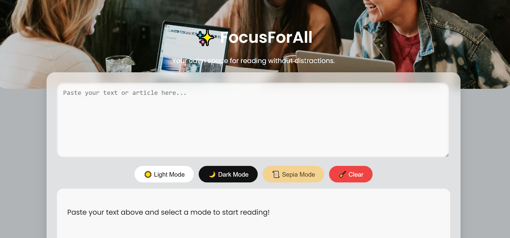
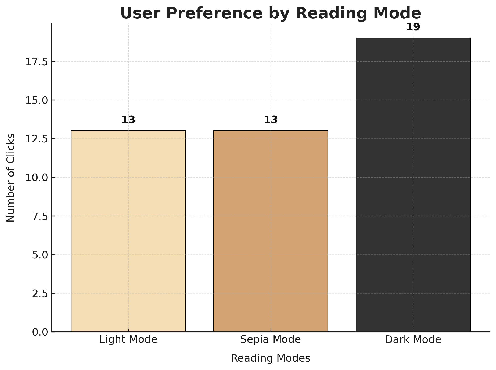

# 🌟 FocusForAll

**FocusForAll** is a distraction-free reading web app designed to help users stay focused and comfortable while reading online.  
It provides **Light, Dark, and Sepia** modes to reduce eye strain and enhance visual comfort for all types of readers.

---

## 💡 Features
- 🌓 Three reading modes — Light, Dark, and Sepia  
- ✨ Clean, minimal UI for focused reading  
- ♿ Accessibility-friendly color contrast  
- 📊 Integrated **Microsoft Clarity** for heatmaps and click tracking  
- 🌐 Fully responsive and works on desktop & mobile  

---

##  Visual Experience Insights
Using analytics, **Dark Mode** was found to be the most preferred by users with **19 clicks**, compared to **13** for both Light and Sepia modes — proving that design and contrast strongly affect user engagement.

---

##  Tech Stack
- **Frontend:** HTML, CSS, JavaScript  
- **Analytics:** Microsoft Clarity  
- **Deployment:** Netlify  

---

## How to Use
1. Paste your text or article in the input area.  
2. Choose a mode (Light, Dark, or Sepia).  
3. Start reading without distractions!  
4. Use Microsoft Clarity to view user heatmaps and clicks.  

---

##  Project Goal
To explore how **design and accessibility choices** impact user engagement using **visual analytics tools**.

---

## 📸 Screenshots

###  App Interface

### Heatmap View

###  User Click Analysis

"""

